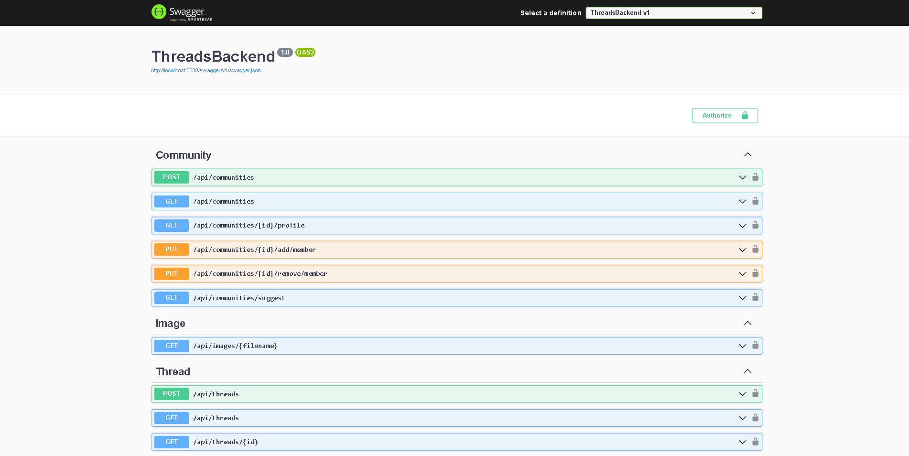

# Application - Threads

Check the [frontend here](https://github.com/matheusjustino/threads-frontend)!

## Resume

    This is an application where users can register and make posts to interact with other users. In addition, it's also possible to create, participate and publish in communities.

## Information

**In this project were used:** **`C# .NET 7.0, Entity Framework and Vercel PostgreSQL`**
**as main tools and technologies.**

## Application Screenshots

